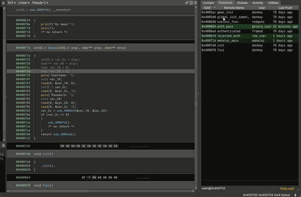
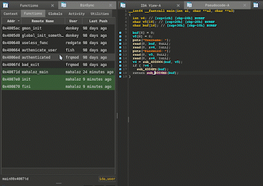
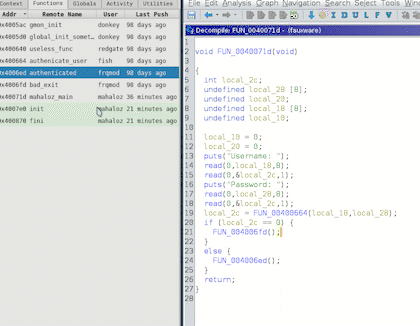

# BinSync

<p align="center">
   
</p>

BinSync is a decompiler collaboration tool built on the Git versioning system to enable fined-grained reverse
engineering collaboration regardless of decompiler. BinSync is built by [mahaloz](https://github.com/mahaloz), 
the [angr](https://angr.io) team, and the [SEFCOM](https://sefcom.asu.edu) research lab. It's also due
in large part to its use by the [Shellphish](https://shellphish.net) hacking team. 

All good decompilers share common objects called Reverse Engineering Artifacts (REAs). These REAs are the
center of BinSync's syncing ability. Here are the supported REAs:
- Function headers (symbol, args, type)
- Stack Variables (symbol, type)
- Structs
- Enums
- Comments

Note: all types support user-created types like structs.

<p align="center">
   
</p>

**Join our discord below for more online help**:

[](https://discord.gg/wZSCeXnEvR)

## Quick Start
For all installs, it's best to use our two-part installer with Python:
```bash
pip3 install binsync && binsync --install 
```

BinSync is also available in the Binary Ninja plugin manager.
**If you plan on using BS with Ghidra**, you need to also do `pip3 install binsync[ghidra]`.
If you plan on using extra BS features, like the ChatGPT User, install the package like this: `pip3 install binsync[extras]`, which will install extra packages for support.
For full install information, please read our [quickstart docs](https://binsync.net/docs/home).

If you are planning on installing the package to be editable (`-e`), like in a developer install, make sure `pip>=23.0.0`.

## Supported Platforms
- IDA Pro: **>= 7.3**
- Binary Ninja: **>= 2.4**
- angr-management: **>= 9.0**
- Ghidra: **>= 10.1**

All versions require **Python >= 3.8** and **Git** installed on your system. 
Ghidra support is still very much in early stage, so only expect the minimal features like artifact name syncing and comments.


## Decompiler Support Progress
Although we support the decompilers in the earlier section, not every decompiler is supported at the same level of syncing. 
To understand the difference between artifact support, pull, push, and auto push, read our [decompiler use introduction](https://binsync.net/docs/dec-introduction/).

### IDA Pro

| Operations&nbsp;&nbsp;&nbsp;&nbsp; | Function Headers&nbsp;&nbsp;&nbsp;&nbsp; | Stack Vars&nbsp;&nbsp;&nbsp;&nbsp; | Global Vars&nbsp;&nbsp;&nbsp;&nbsp; | Structs&nbsp;&nbsp;&nbsp;&nbsp; | Enums&nbsp;&nbsp;&nbsp;&nbsp; | Comments&nbsp;&nbsp;&nbsp;&nbsp; |
|------------------------------------|------------------------------------------|------------------------------------|-------------------------------------|---------------------------------|-------------------------------|----------------------------------|
| Symbols   	                        | :white_check_mark: 	                     | :white_check_mark:    	            | :white_check_mark: 	                | :white_check_mark: 	            | :white_check_mark: 	          | :white_check_mark: 	             |
| Types     	                        | :white_check_mark: 	                     | :white_check_mark:    	            | :white_check_mark: 	                | :white_check_mark: 	            | :white_check_mark: 	          | :white_check_mark: 	             |
| Pull      	                        | :white_check_mark: 	                     | :white_check_mark:    	            | :white_check_mark: 	                | :white_check_mark: 	            | :white_check_mark: 	          | :white_check_mark: 	             |
| Push      	                        | :white_check_mark: 	                     | :white_check_mark: 	               | :white_check_mark: 	                | :white_check_mark: 	            | :white_check_mark: 	          | :white_check_mark: 	             |
| Auto Push                          | :white_check_mark: 	                     | :white_check_mark:    	            | :white_check_mark: 	                | :white_check_mark: 	            | :white_check_mark: 	          | :white_check_mark: 	             |

<p align="center">
   
</p>


### Binary Ninja

| Operations&nbsp;&nbsp;&nbsp;&nbsp; | Function Headers&nbsp;&nbsp;&nbsp;&nbsp; | Stack Vars&nbsp;&nbsp;&nbsp;&nbsp; | Global Vars&nbsp;&nbsp;&nbsp;&nbsp; | Structs&nbsp;&nbsp;&nbsp;&nbsp; | Enums&nbsp;&nbsp;&nbsp;&nbsp; | Comments&nbsp;&nbsp;&nbsp;&nbsp; |
|------------------------------------|------------------------------------------|------------------------------------|-------------------------------------|---------------------------------|-------------------------------|----------------------------------|
| Symbols   	                        | :white_check_mark: 	                     | :white_check_mark:    	            | :white_check_mark: 					            | :white_check_mark:   					      | :white_check_mark: 					      | :white_check_mark: 	             |
| Types     	                        | :white_check_mark: 	                     | :white_check_mark:    	            | :white_check_mark: 					            | :white_check_mark:   					      | :white_check_mark: 					      | :white_check_mark: 	             |
| Pull      	                        | :white_check_mark: 	                     | :white_check_mark:    	            | :white_check_mark: 					            | :white_check_mark:   					      | :white_check_mark: 					      | :white_check_mark: 	             |
| Push      	                        | :white_check_mark:                       | :white_check_mark:		               | :white_check_mark:					             | :white_check_mark:			           | :white_check_mark: 					      | :white_check_mark: 					         |
| Auto Push 	                        | :white_check_mark:                       | :white_check_mark:		               | :white_check_mark:					             | :white_check_mark:			           | :white_check_mark: 					      | :white_check_mark: 					         |

<p align="center">
   
</p>

### Ghidra

| Operations&nbsp;&nbsp;&nbsp;&nbsp; | Function Headers&nbsp;&nbsp;&nbsp;&nbsp; | Stack Vars&nbsp;&nbsp;&nbsp;&nbsp; | Global Vars&nbsp;&nbsp;&nbsp;&nbsp; | Structs&nbsp;&nbsp;&nbsp;&nbsp; | Enums&nbsp;&nbsp;&nbsp;&nbsp; | Comments&nbsp;&nbsp;&nbsp;&nbsp; |
|------------------------------------|------------------------------------------|------------------------------------|-------------------------------------|---------------------------------|-------------------------------|----------------------------------|
| Symbols   	                        | :white_check_mark: 	                     | :white_check_mark:    	            | :white_check_mark: 					            | :white_check_mark: 	 					      | :white_check_mark: 					      | :white_check_mark: 	             |
| Types     	                        | :white_check_mark: 	                     | :white_check_mark:    	            | :white_check_mark: 					            | :white_check_mark: 	 					      | :white_check_mark: 					      | :white_check_mark: 	             |
| Pull      	                        | :white_check_mark: 	                     | :white_check_mark:    	            | :white_check_mark:					             | :white_check_mark: 					        | :white_check_mark: 					      | :white_check_mark: 	             |
| Push      	                        | :white_check_mark: 					                 | :white_check_mark:						           | :white_check_mark:				              | :white_check_mark: 						       | :white_check_mark: 					      | :x: 					                        |
| Auto Push 	                        | :x: 					                                | :x:						                          | :x:					                            | :x:					                        | :x: 					                     | :x: 					                        |

<p align="center">
   
</p>

### angr-management

| Operations&nbsp;&nbsp;&nbsp;&nbsp; | Function Headers&nbsp;&nbsp;&nbsp;&nbsp; | Stack Vars&nbsp;&nbsp;&nbsp;&nbsp; | Global Vars&nbsp;&nbsp;&nbsp;&nbsp; | Structs&nbsp;&nbsp;&nbsp;&nbsp; | Enums&nbsp;&nbsp;&nbsp;&nbsp; | Comments&nbsp;&nbsp;&nbsp;&nbsp; |
|------------------------------------|------------------------------------------|------------------------------------|-------------------------------------|---------------------------------|-------------------------------|----------------------------------|
| Symbols   	                        | :white_check_mark: 	                     | :white_check_mark:    	            | :x: 					                           | :x: 					                       | :x: 					                     | :white_check_mark: 	             |
| Types     	                        | :white_check_mark: 	                     | :white_check_mark:    	            | :x: 					                           | :x: 					                       | :x: 					                     | :white_check_mark: 	             |
| Pull      	                        | :white_check_mark: 	                     | :white_check_mark:    	            | :x: 					                           | :x: 					                       | :x: 					                     | :white_check_mark: 	             |
| Push      	                        | :white_check_mark:                       | :white_check_mark:		               | :x:					                            | :x:					                        | :x: 					                     | :white_check_mark: 					         |
| Auto Push 	                        | :white_check_mark:                       | :white_check_mark:		               | :x:					                            | :x:					                        | :x: 					                     | :white_check_mark: 					         |

## Scripting
For scripting please see [Lib BinSync](https://github.com/binsync/libbs), which allows you to do all lifting and data manipulation in Python.
