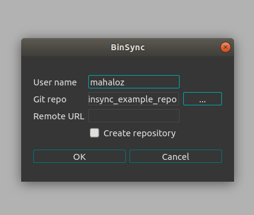
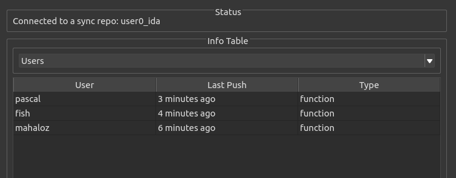
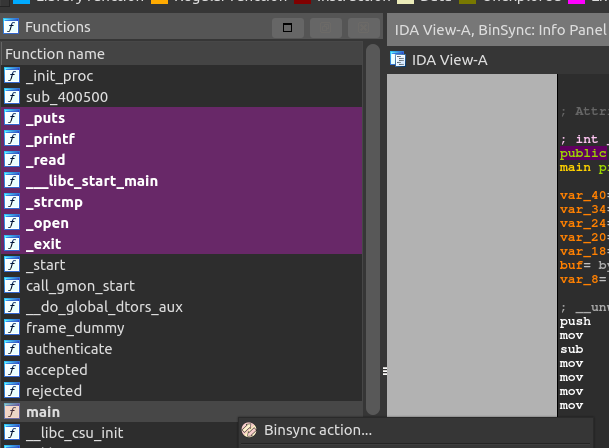
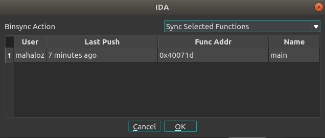

# BinSync

<p align="center">
   
</p>

BinSync is a decompiler collaboration tool built on the Git versioning system to enable fined grained reverse
engineering collaboration regardless of decompiler. 

All good decompilers share common objects called Reverse Engineering Artifacts (REAs). These REAs are the 
center of BinSync's syncing ability. Here are the supported REAs:
- Function headers (symbol, args, type)
- Stack Variables (symbol, type)
- Structs   
- Comments

Note: all types support user-created types like structs.

[](https://discord.gg/wZSCeXnEvR)

## Supported Platforms
- IDA Pro: **>= 7.3**
- Binary Ninja: **>= 2.4**
- angr-management: **>= 9.0**

All versions require **Python >= 3.4** and **Git** installed on your system.

## Installing
### Script (Fast)
Use the installation script provided in the repo:
```bash
./install.sh --ida /path/to/ida/plugins
```

Use `--help`, for more information.

### Manual 
If you are unable to install BinSync with the script above, you are probably on Windows. In that case, installing
BinSync is a two-step process. 
1. Install the core with the Python version associated with your decompiler: `pip3 install -e .`
2. Install the decompiler plugin directly into your decompilers `plugin` folder.

For step 2, you copy all files (and folders) found under the plugin folder in BinSync. An an example, for IDA, 
you would copy everything in `plugins/ida_binsync/*` to the plugins folder.


## Usage
Although BinSync supports various decompilers, which may have not so subtle differences, a lot of the way you interact
with BinSync is standard across all versions. In each decompiler we use the same UI regardless of QT version. 

For decompiler specific intricacies, please see our supported decompilers usage manual in our Wiki.
If you are using Binja, see our extra install steps.

### Validation
1. Copy down a local version of the testing repo and grab the `fauxware` binary
```bash 
git clone git@github.com:mahaloz/binsync_example_repo.git
cp binsync_example_repo/fauxware .
```

2. Open the binary in your decompiler, verify it has loaded in the decompiler terminal
```
[Binsync] v2.1.0 loaded
```
If it does not show, it means the plugin is not in the plugins folder. 

3. 


### Git Prereqs

BinSync's backbone is `git`, which means to use BinSync you must have two things:
1. `git` must be installed on your system.
2. You must use an ssh key to pull and push, AND **it must be password unlocked**.

Number 2 is very important. Many users have complained about BinSync not auto pushing/pulling
things with git and almost all of them did not have their ssh key unlocked. If your key requires you 
to enter a password, you have two options:

1. pull some private repo once so you need to enter your password and unlock the key
2. generate a new key that is not password protected and add it to GitHub (or whatever host you use)

### Manual Install Without Scripts (Windows)
If you are unable to use Bash for whatever reason, the install script only does two things for
every decompiler:
1. Copy the entire folder in `plugins/decoilername_binsync/` to the decompiler plugin folder
2. Install BinSync to the same python the decompiler uses `python3 -m pip install --user -e .`

## Usage  
### Verifying your download works
1. Make a place for sync repos to live
```bash
mkdir ~/sync_repos
cd ~/sync_repos
```
2. Download the testing repo and get the binary out (fauxware)
```bash
```
3. Launch IDA on fauxware
4. Verify your IDAPython terminal says:
```bash
[Binsync] v2.1.0 loaded!
```
5. Open the BinSync Config Pane
   1. You can hit `Ctrl+Shift+B` to open it
   2. OR You can use click `Edit -> Plugins -> Binsync: settings`
6. Give a username and find the example_repo from earlier, click ok
   
7. Verify your IDAPython terminal says (with your username):
```bash
[BinSync]: Client has connected to sync repo with user: mahaloz.
```

8. You should have a few users now in the new Info Panel that has poped up
   

Congrats, your BinSync seems to connect to a repo, and recognize you as a user.
Let's test pulling.

1. Left Click then Right click on the `main` function in the function table
   
2. Click `Binsync action...`
3. Select `mahaloz` as a user and hit OK
   
4. Get your view back to the decompilation view for that function
5. Verify your main now looks like this:
```c
// ***
// This is mahaloz big ole function comment.
// Thanks for using BinSync. <3
// 
// ***
int __cdecl mahaloz_main(int argc, const char **argv, const char **envp)
{
  int ret_val; // [rsp+1Ch] [rbp-24h] BYREF
  mahaloz_struct some_struct; // [rsp+20h] [rbp-20h] BYREF
  char some_char_arr[16]; // [rsp+30h] [rbp-10h] BYREF

  some_char_arr[8] = 0;
  LOBYTE(some_struct.field_8) = 0;
  puts("Username: ");                           // <--- username
  read(0, some_char_arr, 8uLL);
  read(0, &ret_val, 1uLL);
  puts("Password: ");                           // <---- password
  read(0, &some_struct, 8uLL);
  read(0, &ret_val, 1uLL);
  ret_val = authenticate(some_char_arr, &some_struct);
  if ( !ret_val )
    rejected(some_char_arr);
  return accepted(some_char_arr);
}
```

In BinSync, you right-click on the function table to select functions you want to sync.
You can select multiple functions before right-clicking. Play around with other users.